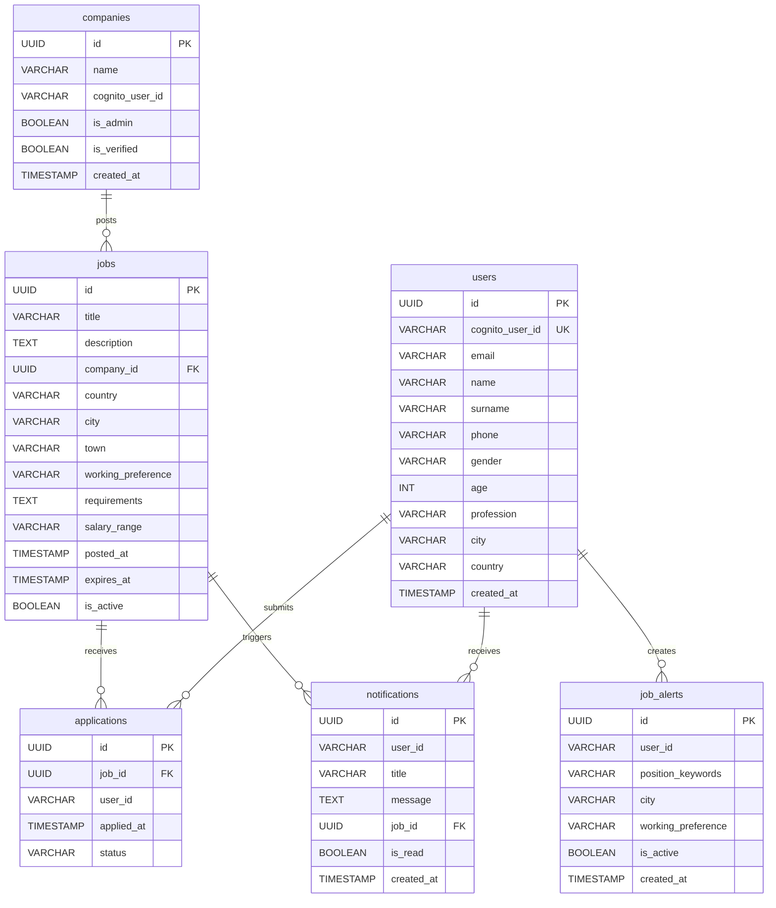

# career.net

A modern job board platform built with an independently deployable microservices architecture.

**Live Demo:** [career-net-ebon.vercel.app](https://career-net-ebon.vercel.app)

**Video Link:** https://drive.google.com/file/d/1oNYiyIjN71FIu5jwe05xElPwfgFs6qKS/view?usp=share_link

---

## Tech Stack

| Layer | Technology |
|---|---|
| Backend | Java 17 + Spring Boot 3.x |
| Frontend | Next.js 16.2.6 + React 19 + TypeScript |
| Styling | Tailwind CSS v4 |
| Primary Database | PostgreSQL (Supabase) |
| NoSQL | MongoDB Atlas |
| Cache | Redis (Upstash) |
| Message Queue | RabbitMQ (CloudAMQP) |
| Authentication | AWS Cognito |
| AI Model | Google Gemini 2.0 Flash |
| Containerization | Docker |
| Cloud | Azure Container Apps + Vercel |

---

## Services

| Service | Port | Responsibility |
|---|---|---|
| `api-gateway` | 8080 | Single entry point, JWT validation |
| `job-service` | 8081 | Job CRUD, Redis cache, RabbitMQ publisher |
| `search-service` | 8082 | Job search, MongoDB search history |
| `notification-service` | 8083 | Notifications, job alerts, user profiles |
| `admin-service` | 8084 | Company registration and approval |
| `ai-agent-service` | 8085 | Gemini-powered AI chat assistant |
| `frontend` | 3000 | Next.js UI |

---

## Features

- **Job Search** — Filter by position, city, country, working preference; Turkish character support
- **Nearby Jobs** — Browser geolocation → nearest jobs via OpenStreetMap
- **Autocomplete** — Real-time suggestions for position and city fields
- **Company Approval Flow** — Company registers → admin approves → job posting enabled
- **Notification System** — Create job alerts, receive notifications for matching new jobs
- **User Profile** — Name, surname, phone, gender, age, profession
- **Application Tracking** — Applied jobs listed in the header dropdown
- **AI Assistant** — Gemini-powered chat; search jobs and query job details conversationally
- **Authentication** — AWS Cognito — register, login, email verification

---

## Local Development

### Prerequisites

- Docker Desktop
- Java 17 + Maven
- Node.js 20+

### Start Local Infrastructure

```bash
docker-compose up -d
```

Starts MongoDB, Redis, and RabbitMQ locally.

### Environment Variables

```bash
cp .env.example .env
```

Fill in `.env`:

```env
# PostgreSQL (Supabase)
DB_HOST=...
DB_PASSWORD=...

# MongoDB Atlas
MONGO_URI=mongodb+srv://...

# Redis (Upstash)
REDIS_URL=rediss://...

# RabbitMQ (CloudAMQP)
RABBITMQ_HOST=...
RABBITMQ_USERNAME=...
RABBITMQ_PASSWORD=...
RABBITMQ_VHOST=...

# AWS Cognito
COGNITO_USER_POOL_ID=...

# Gemini
GEMINI_API_KEY=...
```

### Run a Service

```bash
cd services/job-service
mvn spring-boot:run
```

### Run the Frontend

```bash
cd frontend
npm install
npm run dev
```

---

## Deployment

Backend is deployed on **Azure Container Apps**, frontend on **Vercel**.

### Build & Push Docker Image

```bash
docker build --platform linux/amd64 -t ghcr.io/USERNAME/career-net-job-service:latest services/job-service/
docker push ghcr.io/USERNAME/career-net-job-service:latest
```

Full deployment guide: [docs/deployment.md](docs/deployment.md)

---

## Entity-Relationship Diagram



> **Not:** `applications.user_id` ve `notifications.user_id`, `users.cognito_user_id` üzerinden ilişkilendirilir (UUID FK değil, Cognito sub string).

---

## Architecture

```
Frontend (Vercel)
      │
      ▼
API Gateway (Azure Container Apps)
      │
      ├── job-service          → PostgreSQL + Redis + RabbitMQ
      ├── search-service       → MongoDB + job-service
      ├── notification-service → PostgreSQL + MongoDB + RabbitMQ
      ├── admin-service        → PostgreSQL + job-service
      └── ai-agent-service     → MongoDB + Gemini API
```

For detailed architecture: [docs/architecture.md](docs/architecture.md)

---

## Project Structure

```
career.net/
├── services/
│   ├── api-gateway/
│   ├── job-service/
│   ├── search-service/
│   ├── notification-service/
│   ├── admin-service/
│   └── ai-agent-service/
├── frontend/
├── docs/
│   ├── init.sql
│   ├── architecture.md
│   ├── deployment.md
│   └── phases-and-flows.md
└── docker-compose.yml
```
